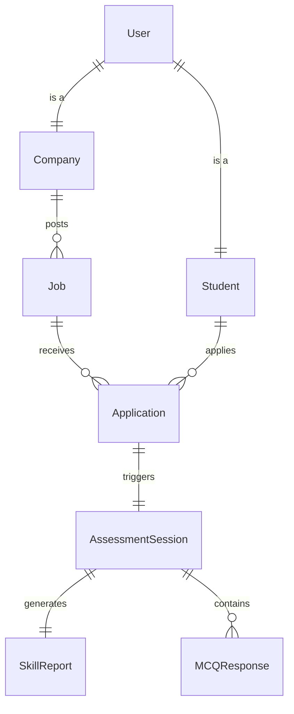

# 🦅 **PROJECT LEGACY CONTEXT**
> *Master Documentation for Resuming FairShot MVP*
> **Last Updated:** December 05, 2025
> **Status:** Sprint 1 Complete (Ticket 3.3) | **Frozen**

---

## 🏗️ **1. Architecture & Tech Stack**

### **Core Stack**
- **Framework:** NestJS (Backend) + Next.js 14 (Frontend)
- **Language:** TypeScript (Strict)
- **Database:** PostgreSQL 16 (via Prisma ORM)
- **Cache/Queue:** Redis (for session management & queues)
- **Payment:** Stripe (Checkout Flow)
- **Code Execution:** Judge0 (via RapidAPI)
- **Proctoring:** WebGazer.js (Eye Tracking) + Page Visibility API
- **Styling:** TailwindCSS + Shadcn/UI

### **Key Patterns**
- **Role-Based Auth:** Distinct `ADMIN`, `COMPANY`, `STUDENT` roles.
  - Guards: `RolesGuard`, `JwtAuthGuard`
- **Atomic Transactions:** Used for critical operations like credit deduction.
  - *Example:* Deducting company credits only when job post succeeds.
- **Throttled WebSockets:**
  - Proctoring events (eye movements, tab switches) are throttled to prevent server overload.
- **Microservice-like Modules:**
  - `AssessmentsModule` is isolated from `UsersModule` for scalability.

### **Schema Relationships**


---

## 📜 **2. Development Timeline & Story**

### **Phases 1-7: Foundation**
- **Phase 1 (Setup):** Initialized monorepo, Dockerized PostgreSQL/Redis.
- **Phase 2 (Auth):** Implemented JWT strategies, bcrypt hashing, and role guards.
- **Phase 3 (Jobs):** Company dashboard with job posting, credit system logic.
- **Phase 4 (Applications):** Student dashboard, resume interaction, application tracking.
- **Phase 5 (Assessments Engine):** Core logic for startSession, timers, and submission.
- **Phase 6 (Proctoring):** Integrated WebGazer, browser restrictions (copy/paste prevention).
- **Phase 7 (Reporting):** AI-powered report generation flow.

### **Sprint 1: The "First Integration" (Tickets 1.1 - 3.3)**
- **Ticket 1.1 (Admin):** Built admin panel for user verification.
- **Ticket 2.1 (Stripe):** Integrated purchasing of credits.
- **Ticket 3.1 (Question Bank):** Created Seeding script for MCQ/Coding questions.
- **Ticket 3.2 (Integration):** Connected Frontend to Backend assessment flow.
- **Ticket 3.3 (Quiz UI):** **(FINAL STATE)** Polished MCQ interface, fixed radio button bugs.

---

## ⚔️ **3. WAR STORIES (Vital for Future Devs)**

> *Read this before touching the code. These are hard-learned lessons.*

### **1. Judge0: The Docker Defeat**
- **Initial Plan:** Host local Judge0 instance using Docker.
- **Failure:** Docker resource consumption killed the dev environment; network bridging issues prevented API access.
- **Pivot:** Switched to **RapidAPI (Judge0 Cloud)**.
- **Impact:** Reliable execution, zero maintenance. *Never try to host Judge0 locally on a dev machine again.*

### **2. Stripe: The Webhook CLI Nightmare**
- **Initial Plan:** Full webhook integration for payment confirmation.
- **Failure:** Stripe CLI login issues and Windows pathing errors made local webhook testing impossible.
- **Pivot:** Implemented **Checkout Session Verification**. We verify the session status directly on the success page load instead of waiting for a webhook.
- **Note:** Webhooks code exists but is disabled for local dev.

### **3. Billing UI: The Shadcn Override**
- **Problem:** Shadcn `Button` component styles were overriding our custom "Gold/Premium" CSS gradients, making the billing page look flat.
- **Pivot:** Used native HTML `<button>` elements for the pricing cards to ensure exact styling control.
- **Lesson:** Don't force Shadcn components where custom, complex CSS is required.

### **4. Prisma: The Duplicate Model Conflict**
- **Problem:** `MCQQuestion` model conflicted with an older `Question` model during migration.
- **Fix:** Deleted the legacy `Question` model entirely.
- **Lesson:** Always check `schema.prisma` for legacy models before adding new features.

---

## 📸 **4. Current State Snapshot**

### **Fully Functional Features**
✅ **Authentication:** Login/Register (Student/Company/Admin)
✅ **Jobs:** Posting jobs, credit deduction, applicant list
✅ **Billing:** Buying credits via Stripe (Test Mode)
✅ **Assessment:**
  - Start Assessment Button (Student Dashboard)
  - Full Screen Proctoring
  - **Quiz Interface (Tabbed)**
  - Hardcoded Coding Problem (Sprint 1 limitation)
  - Submission & Scoring
✅ **Reporting:** Reports generated and viewable by Company.

### **Pending / Mocked Features**
⚠️ **Coding Problem:** Currently hardcoded to "Two Sum". Dynamic loading is planned for Sprint 2.
⚠️ **Email Notifications:** Mocked in services, not sending emails.
⚠️ **Profile Images:** Placeholder URLs used. upload functionality pending.
⚠️ **Report Generation:** Dependent on Gemini API key availability.

---

## 🚀 **5. HOW TO RESUME**

### **1. Credentials**
- **Admin:** `admin@fairshot.com` / `Admin@123`
- **Student:** `test@student.com` / `password123`
- **Company:** `hr@acme.com` / `password123` (or create new)

### **2. Start Command Sequence**
Run these in separate terminals:

**Terminal 1: Infrastructure**
```bash
# Start Docker containers
docker-compose up -d
```

**Terminal 2: Backend**
```bash
cd apps/api
# Ensure DB is synced
npx prisma generate
npx prisma migrate deploy
# Start Server
npm run start:dev
```

**Terminal 3: Frontend**
```bash
cd apps/web
npm run dev
```

### **3. Verification**
- Access **Frontend**: `http://localhost:3000`
- Access **Backend API**: `http://localhost:4000/api` (Swagger)
- Access **Prisma Studio**: `npx prisma studio` (in api folder)

---

## 🧹 **6. Maintenance & Cleanup**

- **Docs:** All implementation reports have been moved to `docs/archive/`.
- **Dependencies:** Audited. No heavy unused libraries found.
- **Artifacts:** Temporary AI artifacts cleaned up to save space.

> **Project Frozen.** Ready for hibernation. 🧊

