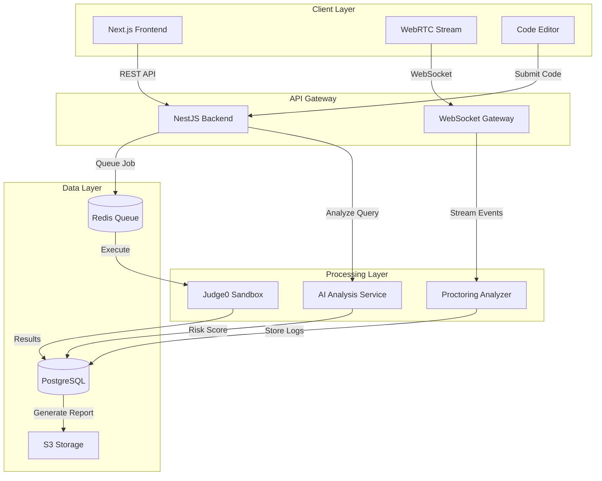

# FairShot - Technology Stack Proposal

## Executive Summary

FairShot requires a **real-time, secure, and scalable** architecture to handle:
- Live proctoring with eye tracking and screen monitoring
- Sandboxed code execution
- AI-powered plagiarism detection
- Complex event logging and analytics

This document proposes a modern, production-ready stack optimized for these unique requirements.

---

## 🎯 Core Technology Decisions

### **Frontend: Next.js 14+ (App Router) + TypeScript + React**

**Why Next.js?**
- ✅ **Server Components**: Reduce client bundle size for faster load times
- ✅ **Built-in API Routes**: Simplifies backend integration
- ✅ **SEO Optimization**: Critical for attracting both students and companies
- ✅ **File-based Routing**: Clean organization for multi-portal architecture
- ✅ **Edge Runtime Support**: Deploy proctoring UI closer to users globally

**UI Framework: Shadcn/ui + Tailwind CSS**
- Modern, accessible components
- Customizable design system
- Rapid prototyping capability

**Real-Time Communication:**
- **WebRTC**: For webcam streaming and eye tracking
- **Socket.IO Client**: For bidirectional event streaming (proctoring logs, live updates)

---

### **Backend: Node.js + NestJS + TypeScript**

**Why NestJS over Django/Flask?**
- ✅ **Native WebSocket Support**: Built-in `@nestjs/websockets` for real-time proctoring
- ✅ **Microservices Ready**: Easy to split proctoring, code execution, and assessment into separate services
- ✅ **TypeScript End-to-End**: Shared types between frontend and backend reduce bugs
- ✅ **Dependency Injection**: Clean architecture for complex business logic
- ✅ **Scalability**: Non-blocking I/O handles thousands of concurrent assessments

**Key Modules:**
1. **Authentication Module**: JWT + Refresh Tokens
2. **Proctoring Service**: WebSocket gateway for live monitoring
3. **Code Execution Service**: Queue-based job processing (Bull + Redis)
4. **AI Analysis Service**: Integrates with OpenAI/Gemini for plagiarism detection
5. **Payment Module**: Stripe integration for pay-per-registration

---

### **Database: PostgreSQL + Prisma ORM**

**Why PostgreSQL?**
- ✅ **JSONB Support**: Store complex proctoring event logs efficiently
- ✅ **Full-Text Search**: Search jobs, skills, and reports
- ✅ **ACID Compliance**: Critical for payment transactions
- ✅ **Scalability**: Handles millions of assessment records

**Why Prisma?**
- Type-safe database queries
- Automatic migrations
- Excellent TypeScript integration
- Built-in connection pooling

**Schema Highlights:**
```prisma
model ProctoringLog {
  id            String   @id @default(cuid())
  assessmentId  String
  timestamp     DateTime
  eventType     String   // "EYE_AWAY", "COPY_PASTE", "TAB_SWITCH"
  metadata      Json     // Store eye coordinates, clipboard content, etc.
  riskScore     Float    // AI-calculated risk (0-1)
}
```

---

### **Code Execution Engine: Docker + Judge0 API**

**The Challenge:**
Running untrusted user code securely without compromising the server.

**Solution: Judge0 (Open Source)**
- ✅ **Pre-built Sandboxing**: Uses Docker + seccomp for isolation
- ✅ **60+ Languages**: Supports JavaScript, Python, Java, C++, etc.
- ✅ **Resource Limits**: CPU/memory constraints prevent abuse
- ✅ **Self-Hosted**: Full control over infrastructure

**Alternative (Custom Solution):**
- **AWS Lambda** (serverless code execution)
- **Firecracker MicroVMs** (ultra-lightweight VMs)

**Recommendation:** Start with **Judge0** for MVP, migrate to custom Lambda if cost becomes an issue at scale.

---

### **Proctoring & Eye Tracking: WebRTC + TensorFlow.js**

**Architecture:**
1. **Webcam Stream**: Captured via WebRTC in the browser
2. **Eye Tracking Model**: TensorFlow.js runs **WebGazer.js** (open-source eye tracking library)
3. **Calibration**: 9-point calibration at test start
4. **Real-Time Analysis**: 
   - Detect gaze direction (on-screen vs. off-screen)
   - Flag prolonged "away" periods (>5 seconds)
   - Detect multiple faces in frame

**Data Flow:**
```
Browser (WebGazer.js) 
  → Extracts eye coordinates every 100ms
  → Sends to Backend via WebSocket
  → Backend stores in ProctoringLog table
  → AI model calculates risk score post-assessment
```

**Privacy Consideration:**
- Store only **gaze coordinates**, not raw video (GDPR compliant)
- Option to delete proctoring data after 30 days

---

### **AI-Powered Plagiarism Detection: OpenAI GPT-4 / Google Gemini**

**The "AI Judge" Logic:**

**Input:** User's search query or code snippet  
**Output:** Risk classification (Green/Yellow/Red)

**Implementation:**
```typescript
async analyzeToolUsage(query: string, context: string): Promise<RiskLevel> {
  const prompt = `
    You are an anti-cheating AI for a coding assessment platform.
    
    Context: The user is solving: "${context}"
    Query: "${query}"
    
    Classify this as:
    - GREEN: Legitimate learning (syntax lookup, documentation)
    - YELLOW: Borderline (asking for algorithm hints)
    - RED: Cheating (copy-paste full solution request)
    
    Respond with JSON: { "level": "GREEN|YELLOW|RED", "reason": "..." }
  `;
  
  const response = await openai.chat.completions.create({
    model: "gpt-4-turbo",
    messages: [{ role: "system", content: prompt }],
    response_format: { type: "json_object" }
  });
  
  return JSON.parse(response.choices[0].message.content);
}
```

**Cost Optimization:**
- Use **Gemini 1.5 Flash** (cheaper, faster) for real-time analysis
- Use **GPT-4** for final report generation (higher quality)

---

### **Infrastructure & DevOps**

**Hosting:**
- **Vercel**: Frontend (Next.js) - Edge deployment, automatic scaling
- **Railway / Render**: Backend (NestJS) - Easy Docker deployment
- **AWS RDS**: PostgreSQL database (managed, auto-backups)
- **Redis Cloud**: Job queues and caching

**File Storage:**
- **AWS S3**: Store assessment resources, generated reports (PDF)
- **CloudFront CDN**: Serve static assets globally

**Monitoring:**
- **Sentry**: Error tracking
- **LogRocket**: Session replay for debugging proctoring issues
- **Prometheus + Grafana**: System metrics

---

## 🔒 Security & Anti-Cheating Measures

### **1. Full-Screen Enforcement**
```javascript
// Detect when user exits full-screen
document.addEventListener('fullscreenchange', () => {
  if (!document.fullscreenElement) {
    logProctoringEvent('FULLSCREEN_EXIT');
    showWarning('Please return to full-screen mode');
  }
});
```

### **2. Tab Switch Detection**
```javascript
document.addEventListener('visibilitychange', () => {
  if (document.hidden) {
    logProctoringEvent('TAB_SWITCH');
    incrementWarningCount();
  }
});
```

### **3. Copy-Paste Monitoring**
```javascript
document.addEventListener('paste', (e) => {
  const pastedContent = e.clipboardData.getData('text');
  logProctoringEvent('PASTE', { content: pastedContent });
  analyzeWithAI(pastedContent); // Check if it's a full solution
});
```

### **4. Network Isolation**
- The in-browser IDE only allows whitelisted domains (MDN, W3Schools)
- Implemented via **Content Security Policy (CSP)** headers

---

## 📊 Data Flow Architecture



---

## 💰 Cost Estimation (Monthly, 1000 Active Users)

| Service | Usage | Cost |
|---------|-------|------|
| Vercel (Frontend) | Hobby → Pro | $20 |
| Railway (Backend) | 2 instances | $40 |
| AWS RDS (PostgreSQL) | db.t3.medium | $60 |
| Redis Cloud | 1GB | $15 |
| Judge0 (Self-hosted) | EC2 t3.medium | $30 |
| OpenAI API | 100K tokens/day | $150 |
| S3 + CloudFront | 100GB storage | $25 |
| **Total** | | **~$340/month** |

**Revenue Model:** If each company pays $5 per student registration, you need **68 registrations/month** to break even.

---

## 🚀 Why This Stack Wins for FairShot

| Requirement | Technology | Justification |
|-------------|-----------|---------------|
| Real-time proctoring | WebSocket (NestJS) + WebRTC | Low-latency bidirectional communication |
| Code sandboxing | Judge0 + Docker | Battle-tested, secure, supports 60+ languages |
| AI plagiarism detection | GPT-4 / Gemini | State-of-the-art NLP for context understanding |
| Scalability | PostgreSQL + Redis + Vercel Edge | Handles 10K+ concurrent assessments |
| Developer experience | TypeScript + Prisma + Next.js | Type safety reduces bugs, faster development |
| Cost efficiency | Self-hosted Judge0 + Gemini Flash | 60% cheaper than AWS Lambda + GPT-4 only |

---

## 🎯 Next Steps

1. ✅ **Review this tech stack** (You are here)
2. ⏭️ Create `SCHEMA.md` with detailed Prisma schema
3. ⏭️ Design `ARCHITECTURE.md` with component diagrams
4. ⏭️ Initialize project scaffolding with chosen stack

---

## Alternative Considerations

### **If Budget is Extremely Tight:**
- Replace OpenAI with **open-source LLMs** (Llama 3 via Groq API - free tier)
- Use **Supabase** instead of AWS RDS (generous free tier)
- Replace Judge0 with **Piston API** (free, community-hosted)

### **If Scaling to 100K+ Users:**
- Migrate to **Kubernetes** for container orchestration
- Use **AWS Lambda** for code execution (auto-scaling)
- Implement **CDN caching** for assessment resources
- Add **read replicas** for PostgreSQL

---

**Questions for You:**
1. Do you have a preference between **OpenAI vs. Gemini** for AI analysis?
2. Should we prioritize **cost optimization** or **feature richness** for MVP?
3. Any existing infrastructure (AWS credits, Vercel team plan) we should leverage?
