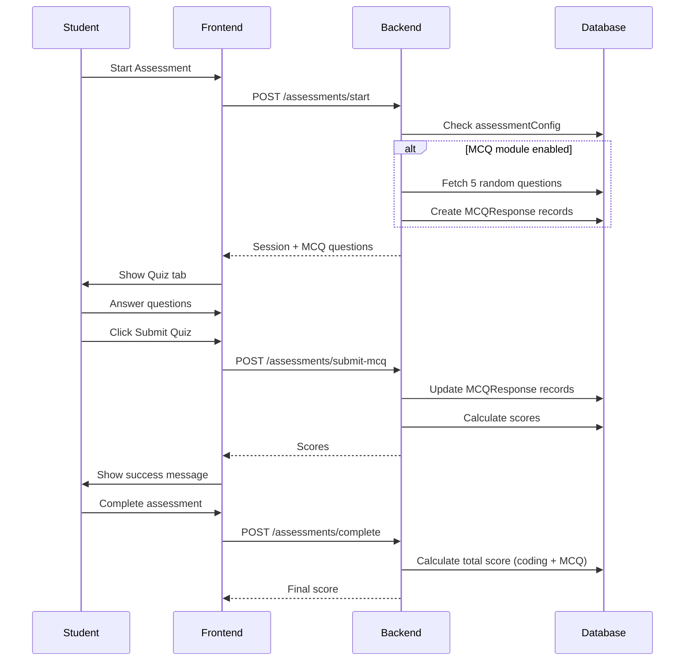

# Ticket 3.2: Assessment Integration - Implementation Plan

**Epic**: 3 - Assessment System  
**Estimated Time**: 4 hours  
**Status**: Planning

---

## 🎯 Objective

Integrate MCQ questions into the assessment system. When a student starts an assessment, the system should fetch random MCQ questions from the question bank and allow students to answer them as part of their assessment.

---

## 📋 Requirements

### **Backend**
1. **Update startSession**: Fetch and assign MCQ questions when session starts
2. **Create MCQResponse records**: Track student answers
3. **Implement submitMCQ**: Handle quiz submission
4. **Update completeSession**: Include MCQ score in total score

### **Frontend**
1. **Add Quiz Tab**: New tab in assessment IDE
2. **Create QuizComponent**: Display questions and collect answers
3. **Submit Quiz**: Send answers to backend
4. **Conditional Display**: Hide tab if job doesn't have MCQs

---

## 🗄️ Database Schema Check

Need to verify MCQResponse model exists and has correct structure.

**Expected Fields:**
- `id` - Unique identifier
- `sessionId` - Link to AssessmentSession
- `questionId` - Link to MCQQuestion
- `selectedAnswer` - Student's answer (0-3)
- `isCorrect` - Boolean (calculated)
- `timeSpentSeconds` - Time tracking
- `answeredAt` - Timestamp

**Note**: We removed MCQResponse in Ticket 3.1. Need to recreate it!

---

## 🏗️ Backend Implementation

### **1. Recreate MCQResponse Model**

**File**: `apps/api/prisma/schema.prisma`

```prisma
model MCQResponse {
  id                String            @id @default(cuid())
  sessionId         String
  session           AssessmentSession @relation(fields: [sessionId], references: [id], onDelete: Cascade)
  questionId        String
  question          MCQQuestion       @relation(fields: [questionId], references: [id])
  
  selectedAnswer    Int?              // Index 0-3
  isCorrect         Boolean?
  timeSpentSeconds  Int               @default(0)
  
  answeredAt        DateTime?
  createdAt         DateTime          @default(now())
  
  @@index([sessionId])
  @@index([questionId])
}
```

**Also update:**
- Add `responses` relation to `MCQQuestion` model
- Add `mcqResponses` relation to `AssessmentSession` model

---

### **2. Update AssessmentsService.startSession**

**File**: `apps/api/src/assessments/assessments.service.ts`

**Current Logic:**
1. Validates student and job
2. Creates AssessmentSession
3. Returns session

**New Logic:**
1. Validates student and job
2. **Check `job.assessmentConfig.modules`**
3. **If includes "MCQ":**
   - Fetch 5 random MCQQuestions
   - Create MCQResponse records for each
4. Creates AssessmentSession
5. **Returns session with `mcqResponses` included**

**Random Selection Strategy:**
```typescript
// Fetch all question IDs
const allQuestions = await prisma.mCQQuestion.findMany({
  select: { id: true }
});

// Shuffle and take 5
const shuffled = allQuestions.sort(() => 0.5 - Math.random());
const selectedIds = shuffled.slice(0, 5).map(q => q.id);

// Fetch full details
const questions = await prisma.mCQQuestion.findMany({
  where: { id: { in: selectedIds } }
});

// Create MCQResponse records
const mcqResponses = await Promise.all(
  questions.map(q => 
    prisma.mCQResponse.create({
      data: {
        sessionId: session.id,
        questionId: q.id
      }
    })
  )
);
```

---

### **3. Create submitMCQ Endpoint**

**File**: `apps/api/src/assessments/assessments.service.ts`

**New Method:**
```typescript
async submitMCQ(sessionId: string, responses: Array<{ questionId: string, selectedAnswer: number }>) {
  // Validate session exists
  // For each response:
  //   - Find MCQResponse record
  //   - Fetch question to get correctAnswer
  //   - Update selectedAnswer
  //   - Calculate isCorrect
  //   - Set answeredAt
  // Return updated responses with scores
}
```

**File**: `apps/api/src/assessments/assessments.controller.ts`

**New Endpoint:**
```typescript
@Post('submit-mcq')
@UseGuards(JwtAuthGuard)
async submitMCQ(@Body() dto: SubmitMCQDto) {
  return this.assessmentsService.submitMCQ(dto.sessionId, dto.responses);
}
```

**DTO**: `apps/api/src/assessments/dto/submit-mcq.dto.ts`
```typescript
class SubmitMCQDto {
  sessionId: string;
  responses: Array<{
    questionId: string;
    selectedAnswer: number;
  }>;
}
```

---

### **4. Update completeSession**

**File**: `apps/api/src/assessments/assessments.service.ts`

**Current Logic:**
- Calculates coding score
- Updates session status
- Returns final score

**New Logic:**
- Calculates coding score
- **Calculates MCQ score** (count correct answers)
- **Combines scores** (e.g., 50% coding + 50% MCQ)
- Updates session with `mcqScore` and `totalScore`
- Returns final score

**Scoring Formula:**
```typescript
const mcqResponses = await prisma.mCQResponse.findMany({
  where: { sessionId }
});

const correctCount = mcqResponses.filter(r => r.isCorrect).length;
const mcqScore = (correctCount / mcqResponses.length) * 100;

// Weighted average
const totalScore = (codingScore * 0.5) + (mcqScore * 0.5);
```

---

## 🎨 Frontend Implementation

### **1. Update Assessment Page Structure**

**File**: `apps/web/app/student/assessment/[id]/page.tsx`

**Current Tabs:**
- Problem
- Browser

**New Tabs:**
- Problem
- **Quiz** (conditional)
- Browser

**Conditional Logic:**
```typescript
const showQuizTab = assessmentConfig?.modules?.includes('MCQ');
```

---

### **2. Create QuizComponent**

**File**: `apps/web/components/assessment/QuizComponent.tsx`

**Props:**
```typescript
interface QuizComponentProps {
  sessionId: string;
  questions: MCQQuestion[];
  onSubmit: (answers: Answer[]) => void;
}
```

**UI Structure:**
```
┌─────────────────────────────────────────┐
│  Quiz (5 Questions)                     │
├─────────────────────────────────────────┤
│  Question 1 of 5                        │
│  What is useState in React?             │
│                                         │
│  ○ To manage component state            │
│  ○ To fetch data from API               │
│  ○ To style components                  │
│  ○ To handle routing                    │
├─────────────────────────────────────────┤
│  [Previous] [Next] [Submit Quiz]        │
└─────────────────────────────────────────┘
```

**Features:**
- Question navigation (Previous/Next)
- Radio button selection
- Answer persistence in local state
- Progress indicator (1 of 5)
- Submit button (disabled until all answered)
- Confirmation dialog before submit

---

### **3. State Management**

**Local State:**
```typescript
const [currentQuestion, setCurrentQuestion] = useState(0);
const [answers, setAnswers] = useState<Record<string, number>>({});
const [submitted, setSubmitted] = useState(false);
```

**Answer Tracking:**
```typescript
const handleAnswerSelect = (questionId: string, answerIndex: number) => {
  setAnswers(prev => ({
    ...prev,
    [questionId]: answerIndex
  }));
};
```

---

### **4. Submit Quiz Logic**

**API Call:**
```typescript
const handleSubmit = async () => {
  const responses = questions.map(q => ({
    questionId: q.id,
    selectedAnswer: answers[q.id]
  }));

  await api.post('/assessments/submit-mcq', {
    sessionId,
    responses
  });

  setSubmitted(true);
  toast({ title: 'Quiz submitted successfully!' });
};
```

---

## 🔌 API Integration

### **New Endpoints**

1. **POST /assessments/submit-mcq**
   - Body: `{ sessionId, responses: [{ questionId, selectedAnswer }] }`
   - Response: Updated MCQResponse records with scores

2. **GET /assessments/session/:id** (Updated)
   - Response now includes `mcqResponses` array

---

## 🧪 Testing Plan

### **Backend Testing**

1. **startSession with MCQs**
   - [ ] Job with MCQ module creates MCQResponse records
   - [ ] Returns 5 random questions
   - [ ] Questions are different each time
   - [ ] Job without MCQ module doesn't create responses

2. **submitMCQ**
   - [ ] Validates session exists
   - [ ] Updates selectedAnswer correctly
   - [ ] Calculates isCorrect correctly
   - [ ] Sets answeredAt timestamp
   - [ ] Returns scores

3. **completeSession**
   - [ ] Includes MCQ score in total
   - [ ] Weighted scoring works
   - [ ] Updates session correctly

### **Frontend Testing**

1. **Quiz Tab**
   - [ ] Shows when job has MCQ module
   - [ ] Hides when job doesn't have MCQ module
   - [ ] Displays all 5 questions

2. **Question Navigation**
   - [ ] Next/Previous buttons work
   - [ ] Progress indicator updates
   - [ ] Selected answers persist

3. **Answer Selection**
   - [ ] Radio buttons work
   - [ ] Can change answer
   - [ ] State updates correctly

4. **Submit Quiz**
   - [ ] Disabled until all answered
   - [ ] Confirmation dialog shows
   - [ ] API call succeeds
   - [ ] Success message displays

---

## 📊 Data Flow



---

## ✅ Implementation Checklist

### **Backend**
- [ ] Recreate MCQResponse model in Prisma schema
- [ ] Run migration
- [ ] Update startSession method
- [ ] Create submitMCQ method
- [ ] Create SubmitMCQDto
- [ ] Add submitMCQ endpoint
- [ ] Update completeSession scoring
- [ ] Test all endpoints

### **Frontend**
- [ ] Create QuizComponent
- [ ] Add Quiz tab to assessment page
- [ ] Implement question navigation
- [ ] Implement answer selection
- [ ] Implement submit logic
- [ ] Add loading states
- [ ] Add error handling
- [ ] Test end-to-end flow

---

## 🚀 Future Enhancements

1. **Time Tracking**: Track time spent on each question
2. **Question Difficulty**: Weight scores by difficulty
3. **Explanation Display**: Show explanations after submission
4. **Review Mode**: Allow reviewing answers before final submit
5. **Partial Credit**: Award points for partially correct answers
6. **Question Pool**: Select from specific tags/categories
7. **Adaptive Testing**: Adjust difficulty based on performance

---

## 🔒 Security Considerations

1. **Session Validation**: Verify student owns the session
2. **One-Time Submission**: Prevent multiple submissions
3. **Answer Validation**: Validate selectedAnswer is 0-3
4. **Question Integrity**: Don't expose correctAnswer to frontend
5. **Time Limits**: Enforce quiz time limits

---

**Status**: Ready for implementation ✅
